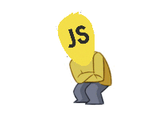

# How to Pick Good JavaScript Libraries
## <!-- .element: style="text-transform: lowercase;" --> by [@elijahmanor](http://twitter.com/elijahmanor) 

Notes: The ideas covered address either a specific focused library (micro-library) or a large framework with lots of bells and whistles. My intent isn't to say "You should use XYZ library", however, it is to describe the things I look for when picking a library (whether large or small) for a project.

Once a library is integrated into your project you create a dependency on it and if it doesn't meet many of the above criteria, then it could end up being a painful relationship in the future. I find myself regularly using a set of rules to "assess" a project before using it.

I also want to discuss the risks if a library doesn't meet one or more of these criteria. For example, if the project hasn't been maintained for a while or if there is only one main contributor, then you as a consumer may need to accept the risk of taking over the project or fixing bugs as they arise in your application. I've seen too many projects where the creator changes passions or gets to busy with other projects. 

 <!-- .element: class="gif" -->
 <!-- .element: class="gif" -->
 <!-- .element: class="gif" -->
 <!-- .element: class="gif" -->
 <!-- .element: class="gif" -->
 <!-- .element: class="gif" -->
 <!-- .element: class="gif fragment" -->

---

## `me.json`

```
{
  "priorities" : [ "Christian", "Family", "Work" ],
  "work"       : [ "@DaveRamsey", "@PluralSight" ],
  "tech"       : [ "HTML", "CSS", "JavaScript" ],
  "titles"     : [ "MS RD", "MS MVP", "IE userAgent" ]
}
```

------

## It's A Green Mario!
### A.K.A. Luigi

 <!-- .element: style="height: 12em;" -->

---

# Mr. JavaScript

> "Hello, my name is Mr. JavaScript..."

 <!-- .element: class="gif" -->

---

# History
### How Did We Get To Where We Are?

------

## A Blast From the Past

* <!-- .element: class="fragment" --> Created in <strong>10 days</strong> in May 1995 by <strong>Brendan Eich</strong> to meet Netscape Navigator 2.0 beta
* <!-- .element: class="fragment" --> Developed under the name <strong>Mocha</strong> and then changed to... <span><strong>LiveScript</strong> (to denote its dynamic nature)</span> <!-- .element: class="fragment" -->
* <!-- .element: class="fragment" --> Before the end of beta, Sun trademarked the name <strong>JavaScript</strong> as a marketing move

<br/><blockquote class="fragment">"And we were pushing it as a little brother to Java, as a complementary language like Visual Basic was to C++ in Microsoft's language families at the time." --Brenden Eich</blockquote>

------

## Java is to JavaScript as...

 <!-- .element: class="fragment" style="height: 12em;" data-fragment-index="1" -->

### Alf is to Gandalf <!-- .element: class="fragment" data-fragment-index="1" --> 

------

## The Web is Now Dynamic
### Validation, Toggle Visibility, etc...

 <!-- .element: class="gif" -->

------

## Unexpected Rise in Popularity
### Front-End Web Developers

 <!-- .element: class="gif" -->

------

## In the Spotlight
### Single Page Apps (SPAs)

 <!-- .element: class="gif" -->

------

## JavaScript Everywhere!
### MEAN - MongoDB, Express, Angularjs, Node.js 

 <!-- .element: class="gif" -->

---

# Emotions 
### The Process We Go Through As Developers

------

## How You See Yourself Using a Library
### Everything is Awesome!

 <!-- .element: class="gif" -->

------

## What You Look Like As You Learn
### Fake It Until You Make It

 <!-- .element: class="gif" -->

------

## What Often Happens
### Terrible, Horrible, No Good, Very Bad JavaScript

 <!-- .element: class="gif" -->

------

## Put Up Your Defences
### May the Force Be With You

 <!-- .element: class="gif" -->

---

# JavaScript Overload

------

## Too Many Choices!

 <!-- .element: class="gif" -->

------

## Googolplex + 1

<pre class="fragment"><code>$ bower search 'angular' | grep -c 'angular'
2652
</code></pre>

<pre class="fragment"><code>$ npm search 'angular' | grep -c 'angular'
1212
</code></pre>

---

# JavaScript Impact Quotient (JS-IQ)

------

## JavaScript Impact Quotient (JS-IQ)

1. Active
2. Documentation <!-- .element: class="fragment" -->
3. Community <!-- .element: class="fragment" -->
4. Credible <!-- .element: class="fragment" -->
5. Extensible <!-- .element: class="fragment" -->
6. Integration <!-- .element: class="fragment" -->
7. Modular  <!-- .element: class="fragment" -->
8. Quality <!-- .element: class="fragment" -->
9. Tests <!-- .element: class="fragment" -->

------

## The 9 Lives of JavaScript
### JavaScript Impact Quotient (JS-IQ)

Active, Documentation, Community, Credible, Extensible, Integration, Modular, Quality, Tests

 <!-- .element: class="gif" -->

---

# Active

------

## When was it last updated?

* This week <!-- .element: class="fragment" data-fragment-index="1" -->
* This month <!-- .element: class="fragment" data-fragment-index="2" -->
* This quarter <!-- .element: class="fragment" data-fragment-index="3" -->
* This year!?! <!-- .element: class="fragment" data-fragment-index="4" -->

 <!-- .element: class="gif fragment" data-fragment-index="4" -->

------

## Are Issues Being Addressed?

------

## Are Pull Requests being Considered?

---

# Documentation
<!-- .slide: data-background="" -->

------

## Initial Impresion 
### Do You Know What It Does?

 <!-- .element: class="gif fragment" -->

------

## Different Learning Styles

* High Level Abstract <!-- .element: class="fragment" -->
* Code Splunk <!-- .element: class="fragment" -->
* API Dive <!-- .element: class="fragment" -->
* Code Exmpales <!-- .element: class="fragment" -->
* Demo Apps <!-- .element: class="fragment" -->
* Unit Tests <!-- .element: class="fragment" -->
* Videos <!-- .element: class="fragment" -->

------

## Combat Stale Documentation
### Autogenerate API Docs

*  <!-- .element: class="fragment" --> [JSDoc](http://usejsdoc.org/)
*  <!-- .element: class="fragment" --> [YUIDoc](http://yui.github.io/yuidoc/)
*  <!-- .element: class="fragment" --> [Docco](http://jashkenas.github.io/docco/)

---

# Community

------

## Are Developers Excited!?!

 <!-- .element: class="gif fragment" -->

------

## GitHub

<span>Contributors</span> <!-- .element: class="fragment" -->
<span>, Commits</span> <!-- .element: class="fragment" -->
<span>, Favorites</span> <!-- .element: class="fragment" -->
<span>, Forks</span> <!-- .element: class="fragment" -->
<span>, Pull Requests (Open & Closed)</span> <!-- .element: class="fragment" -->

 <!-- .element: class="gif fragment" -->

------

## Stack Overflow
### In the trenches

* Are Quesitons Being Asked? <!-- .element: class="fragment" -->
* Are the Questions Being Answered? <!-- .element: class="fragment" -->
* Are the Questions/Answers Being Voted Up? <!-- .element: class="fragment" -->

------

## Social Media
### Signs of Health

* Is there an Active Buzz on Twitter, Google Plus, etc...? <!-- .element: class="fragment" -->
* Are Developers Blogging about the Library? <!-- .element: class="fragment" -->

---

# Credible

------

## Trusted Author(s)

* Who authored the library? <!-- .element: class="fragment" -->
* What else have they created? <!-- .element: class="fragment" -->

------

## There Should Not Be Only One

 <!-- .element: class="gif" -->

------

## The Stop Sign Principle 

> What happens when the original author is out of the picture?

 <!-- .element: class="gif fragment" -->

------

## Good Examples

* <!-- .element: class="fragment" --> jQuery: A Team of Passionate JavaScript Developers <span class="fragment">(example: from John Resig to Dave Methvin)</span>
* <!-- .element: class="fragment" --> Angular: A Team of Developers Backed by Google
* <!-- .element: class="fragment" --> React: A Team of Developers Backed by Facebook/Instagram

---

# Extensible

------

## Everything is Fine...
## Until I need to do `XYZ`

 <!-- .element: class="gif fragment" -->

------

## Let Me Try This Hack, or This One, or...

 <!-- .element: class="gif fragment" -->

---

# Integration

------

## I'll Just Integrate this JavaScript
## into my Application

 <!-- .element: class="gif fragment" -->

------

## Punched in the Face by Incompatibility

 <!-- .element: class="gif fragment" -->

---

# Modular

------

## All Or Nothing

 <!-- .element: class="gif fragment" -->

------

## Examples of Modularity

* <!-- .element: class="fragment" --> [Angular](https://angularjs.org/)
* <!-- .element: class="fragment" --> [jQuery](http://jquery.com) v1.8+
* <!-- .element: class="fragment" --> [jQuery UI](http://jqueryui.com)
* <!-- .element: class="fragment" --> [Modernizr](http://modernizr.com/)
* <!-- .element: class="fragment" --> [Lo-Dash](https://lodash.com/)

---

# Quality

------

## You Open the Source Code

 <!-- .element: class="gif fragment" -->

------

## Shed a Single JavaScript Tear

 <!-- .element: class="gif fragment" -->

------

## There Has to Be a Better Way
### Static Analysis Tools

------

## JavaScript

* <!-- .element: class="fragment" --> [JSLint/JSHint/ESLint](http://jshint.com)
* <!-- .element: class="fragment" --> [FixMyJS](https://github.com/jshint/fixmyjs) - Automatically fix silly lint errors (example: [http://fixmyjs.com](http://fixmyjs.com)) by [@ goatslacker](http://twitter.com/goatslacker) 
* <!-- .element: class="fragment" --> [Plato](https://github.com/es-analysis/plato) - Visualize JavaScript Complexity by [@jsoverson](http://twitter.com/jsoverson) (example: [jQuery](http://jsoverson.github.io/plato/examples/jquery/))
(jscc) by [@tbusser](http://twitter.com/tbusser)
* <!-- .element: class="fragment" --> [JSCritic](http://jscritic.com/) by [@kangax](http://twitter.com/kangax)
* <!-- .element: class="fragment" --> [JavaScript Code Style Checker](https://github.com/jscs-dev/node-jscs) (jscs) by [@jscs_dev](http://twitter.com/jscs_dev)
* <!-- .element: class="fragment" --> [JS Inspect](https://github.com/danielstjules/jsinspect) - Detect copy-pasted and structurally similar code by [@danielstjules](http://twitter.com/danielstjules)

Notes: [JavaScript Compatibility Checker](http://jscc.info/) 

---

# Tests

------

## Looks Like It'll Work, but Nope

 <!-- .element: class="gif fragment" --> 

------

## The Library Is Barely Stable

 <!-- .element: class="gif fragment" --> 

------

## In the End

 <!-- .element: class="gif fragment" --> 

------

## There Has to Be a Better Way
### Testing Tools

------

## Testing Tools

* <!-- .element: class="fragment" --> [QUnit](http://qunitjs.com/)
* <!-- .element: class="fragment" --> [Jasmine](http://jasmine.github.io/2.0/introduction.html)
* <!-- .element: class="fragment" --> [Mocha](http://mochajs.org/)
* <!-- .element: class="fragment" --> [Karma](https://github.com/karma-runner/karma)
* <!-- .element: class="fragment" --> [Jest](http://facebook.github.io/jest/)
* <!-- .element: class="fragment" --> [PhantomJS](http://phantomjs.org/)
* <!-- .element: class="fragment" --> [Sinon](http://sinonjs.org/)
* <!-- .element: class="fragment" --> [Blanket.js](http://blanketjs.org/)
* <!-- .element: class="fragment" --> [Istanbul](http://gotwarlost.github.io/istanbul/)

---

# What's [Reveal's](https://github.com/hakimel/reveal.js) JS-IQ?

<div class="js-iq">
	<div><input type="checkbox" /> <lable>Active</label></div>
	<div><input type="checkbox" /> <lable>Documentation</label></div>
	<div><input type="checkbox" /> <lable>Community</label></div>
	<div><input type="checkbox" /> <lable>Credible</label></div>
	<div><input type="checkbox" /> <lable>Extensible</label></div>
	<div><input type="checkbox" /> <lable>Integration</label></div>
	<div><input type="checkbox" /> <lable>Modular</label></div>
	<div><input type="checkbox" /> <lable>Quality</label></div>
	<div><input type="checkbox" /> <lable>Tests</label></div>
</div>

---

# Questions?

<pre style="font-size: 1.25em; box-shadow: none;">
<a href="http://elijahmanor.com]" class="fragment" style="margin-left: 2em;">http://elijahmanor.com</a>
<a href="http://twitter.com/elijahmanor" class="fragment" style="margin-left: 5.5em;">@elijahmanor</a>
<a href="mailto:elijahmanor@gmail.com" class="fragment" style="position: absolute; left: 6.1em;">elijahmanor@gmail.com</a>
</pre>

 <!-- .element: class="fragment" style="height: 5em;" -->

<pre style="font-size: 1.25em; box-shadow: none;">
<a href="http://bit.ly/good-js-libs" class="fragment" style="position: absolute; left: 3em;">http://bit.ly/good-js-libs</a>
</pre>


---

# Random Thoughts

------

## Window/RequireJS/CommonJS Support

```
(function (name, definition, context, dependencies) {
  if (typeof context['module'] !== 'undefined' && context['module']['exports']) { if (dependencies && context['require']) { for (var i = 0; i < dependencies.length; i++) context[dependencies[i]] = context['require'](dependencies[i]); } context['module']['exports'] = definition.apply(context); }
  else if (typeof context['define'] !== 'undefined' && context['define'] === 'function' && context['define']['amd']) { define(name, (dependencies || []), definition); }
  else { context[name] = definition(); }
})('namespace', function () {
  // Insert code here
  return {
    hello: function(name) {
      console.log('Hello ' + name + '!');
    }
  };
}, (this || {}));
```

<small><a href="http://stackoverflow.com/questions/13673346/supporting-both-commonjs-and-amd">Supporting both CommonJS and AMD</small>

------

## Window/RequireJS/CommonJS Usage

#### Window (HTML) <!-- .element: class="fragment" data-fragment-index="1" --> 

<pre class="fragment" data-fragment-index="1"><code>&lt;script src="namespace.js"&gt;&lt;/script&gt;
&lt;script&gt;namespace.hello('World');&lt;/script&gt;
</code></pre>

#### AMD (RequireJS) <!-- .element: class="fragment" data-fragment-index="2" --> 

<pre class="fragment" data-fragment-index="2"><code>requirejs(['namespace'], function(namespace) {
    namespace.sayHi('World');
});
</code></pre>

#### CommonJS (NodeJS) <!-- .element: class="fragment" data-fragment-index="3" --> 

<pre class="fragment" data-fragment-index="3"><code>var module = require('./namespace');
namespace.hello('World');
</code></pre>

------

## HTML Tools

* <!-- .element: class="fragment" --> [HTMLHint](http://htmlhint.com/)
* <!-- .element: class="fragment" --> [w3cjs](https://github.com/thomasdavis/w3cjs)

------

## CSS Tools

* <!-- .element: class="fragment" --> [CSSLint](http://csslint.net/) by [@slicknet](http://twitter.com/slicknet) & [@stubbornella](http://twitter.com/stubbornella)
* <!-- .element: class="fragment" --> [SCSS-Lint](https://github.com/causes/scss-lint)
* <!-- .element: class="fragment" --> [CSS Colorguard](https://github.com/SlexAxton/css-colorguard) - Keep a watchful eye on your css colors by [@SlexAxton](http://twitter.com/SlexAxton)
* <!-- .element: class="fragment" --> [SassDoc](http://sassdoc.com/)

------

## Compression Tools

* <!-- .element: class="fragment" --> [UglifyJS](https://github.com/gruntjs/grunt-contrib-uglify)
* <!-- .element: class="fragment" --> [CSSMin](https://github.com/gruntjs/grunt-contrib-cssmin)
* <!-- .element: class="fragment" --> [HTMLMin](https://github.com/gruntjs/grunt-contrib-htmlmin)
* <!-- .element: class="fragment" --> [ImageMin](https://github.com/gruntjs/grunt-contrib-imagemin)
* <!-- .element: class="fragment" --> [SVGMin](https://github.com/sindresorhus/grunt-svgmin)

------

## Dive Into Tools

* <!-- .element: class="fragment" --> [Plato](https://github.com/es-analysis/plato) - Visualize JavaScript Complexity by [@jsoverson](http://twitter.com/jsoverson) (example: [jQuery](http://jsoverson.github.io/plato/examples/jquery/))
(jscc) by [@tbusser](http://twitter.com/tbusser)
* <!-- .element: class="fragment" --> [JS Inspect](https://github.com/danielstjules/jsinspect) - Detect copy-pasted and structurally similar code by [@danielstjules](http://twitter.com/danielstjules)

